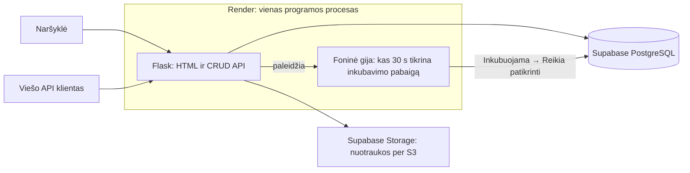

# Culture Log – inkubavimo terminų stebėjimas

SHA-256 skaičiavimą pakeičia praktiška foninė operacija: kas 30 sekundžių tikrinama planuojama inkubavimo pabaiga. Jei pabaigos diena jau praėjo, „Inkubuojama“ tampa „Reikia patikrinti“. Būsena „Baigta“ automatiškai nekeičiama.

## Naudojimas

1. Sukurkite mėginį: įveskite pavadinimą, kolonijų skaičių, temperatūrą, surinkimo datą, inkubavimo pradžią ir planuojamą pabaigą. Galite pridėti nuotrauką.
2. Pasirinktos pabaigos dienos metu mėginys dar inkubuojamas. Terminas laikomas praėjusiu nuo kitos dienos pradžios, pagal Europe/Vilnius laiką.
3. Per artimiausią foninį patikrinimą būsena pasikeičia į „Reikia patikrinti“.
4. Peržiūrėję mėginį ir atnaujinę rezultatą (pvz., kolonijų skaičių), redagavimo formoje pažymėkite „Baigta“.

Sąrašo ir detalios peržiūros puslapiai atsinaujina kas 30 s. Forma automatiškai neatnaujinama, kad nedingtų įvedami duomenys. Būsenos pasikeitimas atvertame puslapyje gali pasirodyti per maždaug 60 s (foninis tikrinimas ir puslapio atnaujinimas turi atskirus intervalus).

Demonstracijai pasirinkite surinkimo ir pradžios datas užvakar, o pabaigą vakar. Palikite „Inkubuojama“ ir palaukite. Kitą lėkštelę pažymėkite „Baigta“ – jos būsena nesikeis. Inkubavimo trukmę pasirenka vartotojas; programa nenustato biologinio mėginio tinkamumo.

## Paleidimas kompiuteryje

Reikia Python 3.10 ar naujesnės versijos. Terminale atverkite projekto aplanką:

```sh
python3 -m venv .venv
source .venv/bin/activate
pip install -r requirements.txt
python app.py
```

Atverkite http://127.0.0.1:5000. Vietiniai duomenys laikomi `instance/samples.db`, nuotraukos – `uploads/`.

## Esami duomenys

Pirmas paleidimas automatiškai prideda inkubavimo laukus prie senos lentelės. ZIP esančios originalios SQLite duomenų bazės ir nuotraukos išsaugotos. Senų įrašų pradžia prilyginama surinkimo datai, pabaiga – pradžia + 7 dienos. Tai tik pradinis užpildymas: patikslinkite datas redagavimo formoje. Seni nuotraukos būsenos ir SHA-256 stulpeliai duomenų bazėje gali likti, tačiau programa jų nebenaudoja.

Prieš pritaikydami pakeitimą kitai esamai duomenų bazei pasidarykite jos kopiją. Atnaujinimas pritaikytas šiame projekte buvusiai lentelei; tai nėra bendra duomenų bazės migracijų sistema.

## Render ir Supabase

GitHub saugykloje laikykite kodą, `templates`, `requirements.txt`, `Procfile` ir dokumentaciją. `.gitignore` neleidžia naujai įtraukti vietinės duomenų bazės, nuotraukų ir paslapčių.

Render sukurkite Python Web Service:

- Build Command: `pip install -r requirements.txt`
- Start Command: `gunicorn --workers 1 --bind 0.0.0.0:$PORT app:app`
- Root Directory: aplankas, kuriame yra `app.py` (jeigu saugykloje jis vadinasi `culture-log`, nurodykite šį aplanką).

Aplinkos kintamieji:

| Pavadinimas | Reikšmė |
| --- | --- |
| `DATABASE_URL` | Supabase PostgreSQL Session pooler prisijungimo URL su `sslmode=require` |
| `SECRET_KEY` | Ilga atsitiktinė slapta reikšmė |
| `S3_BUCKET` | Supabase Storage talpyklos pavadinimas |
| `S3_ENDPOINT` | Supabase S3 nustatymuose pateiktas adresas |
| `AWS_ACCESS_KEY_ID` | Supabase sugeneruotas S3 Access Key ID |
| `AWS_SECRET_ACCESS_KEY` | Supabase sugeneruotas S3 Secret Access Key |
| `AWS_DEFAULT_REGION` | Supabase projekto regionas |
| `APP_TIMEZONE` | Nebūtinas; numatyta `Europe/Vilnius` |

Raktus įrašykite tik serverio aplinkos nustatymuose. Esama failų saugykla naudoja S3 suderinamą `boto3` klientą. Debesijos prisijungimas šio pakeitimo metu nebuvo išbandytas. SQLite duomenys ir vietinės nuotraukos į Supabase automatiškai nepersikelia.

Vienas Gunicorn procesas paleidžia vieną foninę giją; nenaudokite `--preload` ar kelių workers. Foninė operacija nereikalauja naujų bibliotekų ar atskiros mokamos paslaugos. Užmigus arba sustojus web paslaugai tikrinimas nevyksta, tačiau programa jį atlieka vėl paleista. Tai paprastas demonstracinis sprendimas, o ne nuolat veikiančio planuoklio garantija. `BACKGROUND_ENABLED=0` išjungia foninę giją testavimui.

## Viešas API

- `GET /api/samples` – sąrašas.
- `GET /api/samples/<id>` – vienas įrašas.
- `POST /api/samples` – sukurti.
- `PUT /api/samples/<id>` – atnaujinti visus įvedamus laukus.
- `DELETE /api/samples/<id>` – ištrinti įrašą ir jo nuotrauką.

POST ir PUT JSON pavyzdys:

```json
{
  "name": "Petri lėkštelė A",
  "colony_count": 12,
  "temperature": 25.5,
  "collected_on": "2026-10-05",
  "is_pathogenic": false,
  "incubation_started_on": "2026-10-05",
  "incubation_ends_on": "2026-10-06",
  "incubation_status": "Inkubuojama"
}
```

Datoms naudokite demonstracijos metu tinkamas reikšmes. Būsenos: `Inkubuojama`, `Reikia patikrinti`, `Baigta`. Neteisingi įvedami duomenys grąžina HTTP 400. Nuotraukos keliamos per web formą, API dirba su JSON. Senieji API atsakymo `status` ir `checksum` pakeisti inkubavimo laukais.

Kuriant ir redaguojant tikrinami tekstas, sveikasis skaičius, skaičius su trupmenine dalimi, data ir loginė reikšmė. Pataisytas neteisingų loginio lauko tekstinių reikšmių priėmimas ir skaičiaus priėmimas kaip pavadinimo.

## Architektūra



## Patikrinimas

Vietiniai automatiniai patikrinimai praėjo: senos SQLite bazės atnaujinimas ir pakartotinis paleidimas, puslapių atvaizdavimas, CRUD API, klaidingos įvesties atmetimas kuriant ir redaguojant, datos ribos, užbaigtų lėkštelių būsenos išsaugojimas, nuotraukos įkėlimas, peržiūra ir trynimas. Foninio tikrinimo funkcija patikrinta tiesiogiai; ilgas nuolat veikiančios gijos ir gyvas Render/Supabase bandymas neatliktas.
